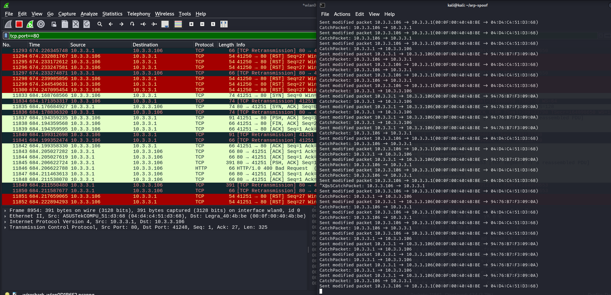

# report arp spoof

> [!CAUTION]
> 악용에 대한 책임을 지지 않습니다

## 과제
arp spoofing 프로그램을 구현하라.

## 실행
```
syntax : arp-spoof <interface> <sender ip 1> <target ip 1> [<sender ip 2> <target ip 2>...]
sample : arp-spoof wlan0 192.168.10.2 192.168.10.1 192.168.10.1 192.168.10.2
```

## 결과



## 상세

- [x] 이전 과제(send-arp)를 다 수행하고 나서 이번 과제를 할 것.
- [x] "arp-spoofing.ppt"의 내용을 숙지할 것.
- [x] 코드에 victim, gateway라는 용어를 사용하지 말고 sender, target(혹은 receiver)라는 단어를 사용할 것.
- [x] sender에서 보내는 spoofed IP packet을 attacker가 수신하면 이를 relay하는 것 코드를 구현할 것.
- [x] sender에서 infect가 풀리는(recover가 되는) 시점을 정확히 파악하여 재감염시키는 코드를 구현할 것.
- [x] (sender, target) flow를 여러개 처리할 수 있도록 코드를 구현할 것.
- [x] 가능하다면 주기적으로 ARP infect packet을 송신하는 기능도 구현해 볼 것.
- [ ] 가능하다면 jumbo frame(패킷의 크기가 큰 패킷)에 대해 relay를 할 수 있도록 해 볼 것.
- [x] attacker, sender, target은 물리적으로 다른 머신이어야 함. 가상환경에서 Guest OS가 attacker, Host OS가 sender가 되거나 하면 안됨.
